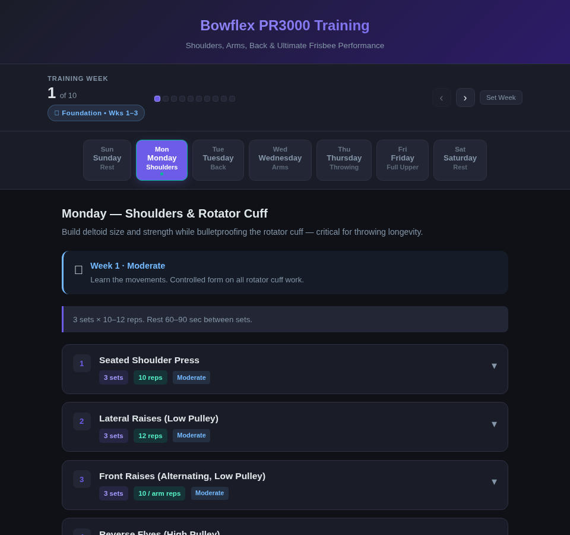

# Bowflex PR3000 Training Plan

An interactive training website built for the **Bowflex PR3000**, designed around **Ultimate Frisbee performance** with a focus on shoulders, arms, and back.

---

## Features

- **Day selector** — click any day of the week to view that day's workout; today is auto-highlighted
- **Week tracker** — track your current week (1–10) across the full training cycle; your week is saved between visits
- **Phase-aware effort guidance** — each day and exercise shows the right intensity level based on your phase:
  - 🏗️ **Foundation** (Weeks 1–3): Learn movement patterns, moderate resistance
  - 📈 **Build** (Weeks 4–6): Progressive overload, climbing resistance
  - 🔥 **Push** (Weeks 7–9): Heavy compounds, speed & power focus on Thursday
  - 🌿 **Deload** (Week 10): ~30% resistance drop, active recovery
- **Expandable exercise cards** — tap any exercise to reveal full instructions, sets/reps, and links
- **ExRx.net links** — every exercise links to its reference page on ExRx.net
- **YouTube links** — select exercises include a video demonstration

---

## Schedule

| Day | Focus |
|---|---|
| Monday | Shoulders & Rotator Cuff |
| Tuesday | Back (Upper & Lower) |
| Wednesday | Arms & Forearms |
| Thursday | Functional Throwing Power |
| Friday | Full Upper Body & Back Integration |
| Saturday | Rest / Light Stretching |
| Sunday | Rest / Light Stretching |

---

## Usage

Open `index.html` in any web browser — no internet connection required to view the site (ExRx and YouTube links will open externally). Your current training week is saved automatically in your browser's local storage.

---

## Progression

Complete the 10-week cycle, then restart at the **Build phase** with higher baseline resistance. Foundation is for learning movements — once the patterns are grooved, you skip straight to progressive overload on your next cycle.
